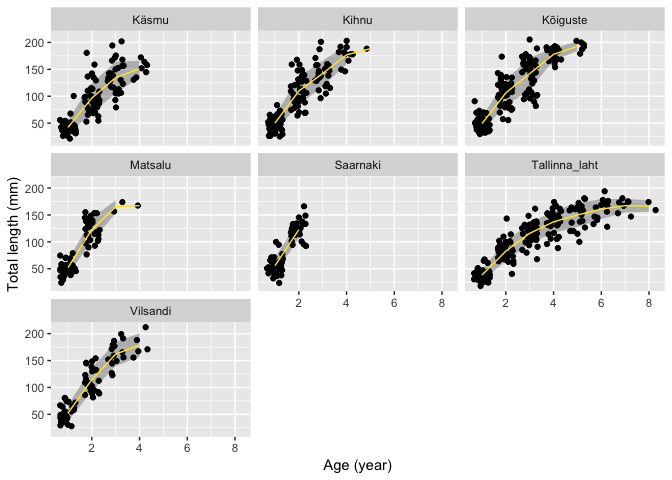

Mudil
================
taavi
2018-10-30

``` r
library(tidyverse)
library(viridis)
library(brms)
mudil <- read_csv("../output/andmed_otoliit.csv")
```

    ## Parsed with column specification:
    ## cols(
    ##   nr = col_integer(),
    ##   sex = col_integer(),
    ##   location = col_character(),
    ##   introduction = col_integer(),
    ##   age = col_integer(),
    ##   tl = col_double()
    ## )

``` r
mudil
```

    ## # A tibble: 961 x 6
    ##       nr   sex location      introduction   age    tl
    ##    <int> <int> <chr>                <int> <int> <dbl>
    ##  1    38     3 Tallinna laht         2005     0  29  
    ##  2    40     3 Tallinna laht         2005     0  33  
    ##  3    42     3 Tallinna laht         2005     0  39  
    ##  4    48     3 Tallinna laht         2005     0  46  
    ##  5    54     3 Kihnu                 2012     1  35.3
    ##  6    56     3 Kihnu                 2012     1  42.8
    ##  7    63     3 Kihnu                 2012     1  44.4
    ##  8    68     3 Kihnu                 2012     1  22.4
    ##  9     6     0 Kihnu                 2012     1  66.5
    ## 10     8     0 Kihnu                 2012     1  33.6
    ## # ... with 951 more rows

Fish id: location + nr

``` r
mudil %>% 
  group_by(nr, age, location) %>% 
  summarise(N = n())
```

    ## # A tibble: 961 x 4
    ## # Groups:   nr, age [?]
    ##       nr   age location          N
    ##    <int> <int> <chr>         <int>
    ##  1     1     1 Käsmu             1
    ##  2     1     1 Kihnu             1
    ##  3     1     1 Kõiguste          1
    ##  4     1     1 Matsalu           1
    ##  5     1     1 Saarnaki          1
    ##  6     1     1 Tallinna laht     1
    ##  7     1     1 Vilsandi          1
    ##  8     1     2 Käsmu             1
    ##  9     1     2 Kihnu             1
    ## 10     1     2 Kõiguste          1
    ## # ... with 951 more rows

``` r
mudil_mod <- mudil %>% 
  mutate(location = str_replace_all(location, "\\s", "_"),
         id = str_c(location, nr, sep = "_"),
         sex = case_when(
           sex == 0 ~ "F",
           sex == 1 ~ "M",
           sex == 3 ~ "juv"
         )) %>% 
  select(id, everything())
```

Only adult fish

``` r
mudil_ad <- filter(mudil_mod, sex != "juv")
```

Mean and sd of fish at different age

``` r
mudil_ad %>% 
  group_by(age) %>% 
  summarise_at("tl", funs(mean, sd))
```

    ## # A tibble: 8 x 3
    ##     age  mean    sd
    ##   <int> <dbl> <dbl>
    ## 1     1  48.4  14.5
    ## 2     2 106.   26.5
    ## 3     3 137.   28.8
    ## 4     4 158.   25.8
    ## 5     5 160.   27.0
    ## 6     6 161.   18.6
    ## 7     7 167.   12.5
    ## 8     8 167.   10.6

Individual growth curves

``` r
ggplot(data = mudil_ad) +
  geom_line(mapping = aes(x = age, y = tl, group = id, color = sex), alpha = 2/3) +
  facet_wrap(~location) +
  scale_color_viridis_d() +
  labs(x = "Age (year)", y = "Total length (mm)")
```


Weird fish in Saarnaki

``` r
fish_id <- mudil_ad %>% 
  filter(location == "Saarnaki") %>% 
  mutate(ad = tl - tl[age == 1]) %>% 
  filter(ad < 0) %>% 
  pull(id)
```

    ## Warning in tl - tl[age == 1]: longer object length is not a multiple of
    ## shorter object length

Drop this weird fish

``` r
mudil_ad <- filter(mudil_ad, id != fish_id)
ggplot(data = mudil_ad) +
  geom_line(mapping = aes(x = age, y = tl, group = id, color = sex), alpha = 2/3) +
  facet_wrap(~location) +
  scale_color_viridis_d() +
  labs(x = "Age (year)", y = "Total length (mm)")
```


Average length at age in adults

``` r
ggplot(data = mudil_ad, mapping = aes(x = age, y = tl)) +
  stat_summary(fun.data = mean_sdl, fun.args = list(mult = 1), geom = "ribbon", alpha = 0.3) +
  geom_point(position = position_jitter(width = 1/3)) +
  stat_summary(fun.y = mean, geom = "line", color = viridis(6)[6]) +
  facet_wrap(~location) +
  labs(x = "Age (year)", y = "Total length (mm)")
```



Starting values for van bertalaffny model coefficients

``` r
library(FSA)
```

    ## ## FSA v0.8.20. See citation('FSA') if used in publication.
    ## ## Run fishR() for related website and fishR('IFAR') for related book.

``` r
svTypical <- vbStarts(tl ~ age, data = mudil_ad)
unlist(svTypical)
```

    ##        Linf           K          t0 
    ## 168.0135717   0.6837691   0.5048853

``` r
# Set up prior with suggested starting values using normal distribution
```

Model with individual variance and different sd per age

``` r
get_prior(bf(tl ~ Linf * (1 - exp(-K * (age - t0))), 
             Linf + K + t0 ~ 0 + location + (1 | id), 
             sigma ~ age, nl = TRUE),
          data = mudil_ad)
```

    ##                  prior     class                  coef group resp  dpar
    ## 1                              b                                       
    ## 2                              b         locationKäsmu                 
    ## 3                              b         locationKihnu                 
    ## 4                              b      locationKõiguste                 
    ## 5                              b       locationMatsalu                 
    ## 6                              b      locationSaarnaki                 
    ## 7                              b locationTallinna_laht                 
    ## 8                              b      locationVilsandi                 
    ## 9  student_t(3, 0, 63)        sd                                       
    ## 10                            sd                          id           
    ## 11                            sd             Intercept    id           
    ## 12                             b                                       
    ## 13                             b         locationKäsmu                 
    ## 14                             b         locationKihnu                 
    ## 15                             b      locationKõiguste                 
    ## 16                             b       locationMatsalu                 
    ## 17                             b      locationSaarnaki                 
    ## 18                             b locationTallinna_laht                 
    ## 19                             b      locationVilsandi                 
    ## 20 student_t(3, 0, 63)        sd                                       
    ## 21                            sd                          id           
    ## 22                            sd             Intercept    id           
    ## 23                             b                                       
    ## 24                             b         locationKäsmu                 
    ## 25                             b         locationKihnu                 
    ## 26                             b      locationKõiguste                 
    ## 27                             b       locationMatsalu                 
    ## 28                             b      locationSaarnaki                 
    ## 29                             b locationTallinna_laht                 
    ## 30                             b      locationVilsandi                 
    ## 31 student_t(3, 0, 63)        sd                                       
    ## 32                            sd                          id           
    ## 33                            sd             Intercept    id           
    ## 34                             b                                  sigma
    ## 35                             b                   age            sigma
    ## 36 student_t(3, 0, 10) Intercept                                  sigma
    ##    nlpar bound
    ## 1      K      
    ## 2      K      
    ## 3      K      
    ## 4      K      
    ## 5      K      
    ## 6      K      
    ## 7      K      
    ## 8      K      
    ## 9      K      
    ## 10     K      
    ## 11     K      
    ## 12  Linf      
    ## 13  Linf      
    ## 14  Linf      
    ## 15  Linf      
    ## 16  Linf      
    ## 17  Linf      
    ## 18  Linf      
    ## 19  Linf      
    ## 20  Linf      
    ## 21  Linf      
    ## 22  Linf      
    ## 23    t0      
    ## 24    t0      
    ## 25    t0      
    ## 26    t0      
    ## 27    t0      
    ## 28    t0      
    ## 29    t0      
    ## 30    t0      
    ## 31    t0      
    ## 32    t0      
    ## 33    t0      
    ## 34            
    ## 35            
    ## 36

Wiki says that adult gobis can be between 150 and 200 mm long, let's take 200 as prior

``` r
kihnu <- prior(normal(200, 30), nlpar = "Linf") +
  prior(normal(0.7, 0.2), nlpar = "K") +
  prior(normal(0.5, 0.2), nlpar = "t0")
```

``` r
fit2 <- brm(bf(tl ~ Linf * (1 - exp(-K * (age - t0))), 
               Linf + K + t0 ~ 0 + location + (1 | id), 
               sigma ~ age, nl = TRUE),
            data = mudil_ad,
            family = gaussian(link = "identity"),
            prior = kihnu,
            chains = 1,
            iter = 4000)
write_rds(fit2, "../output/von_bertalanffy_normal_otol_2.rds")
```

``` r
summary(fit2)
```

    ##  Family: gaussian 
    ##   Links: mu = identity; sigma = log 
    ## Formula: tl ~ Linf * (1 - exp(-K * (age - t0))) 
    ##          Linf ~ 0 + location + (1 | id)
    ##          K ~ 0 + location + (1 | id)
    ##          t0 ~ 0 + location + (1 | id)
    ##          sigma ~ age
    ##    Data: mudil_ad (Number of observations: 791) 
    ## Samples: 1 chains, each with iter = 4000; warmup = 2000; thin = 1;
    ##          total post-warmup samples = 2000
    ## 
    ## Group-Level Effects: 
    ## ~id (Number of levels: 259) 
    ##                    Estimate Est.Error l-95% CI u-95% CI Eff.Sample Rhat
    ## sd(Linf_Intercept)    31.19      2.53    26.24    36.24       1039 1.00
    ## sd(K_Intercept)        0.10      0.01     0.08     0.12        875 1.00
    ## sd(t0_Intercept)       0.08      0.02     0.04     0.11        397 1.00
    ## 
    ## Population-Level Effects: 
    ##                            Estimate Est.Error l-95% CI u-95% CI Eff.Sample
    ## sigma_Intercept                2.16      0.11     1.94     2.38        574
    ## Linf_locationKäsmu           205.93     12.64   182.20   232.12       1682
    ## Linf_locationKihnu           242.31     12.40   219.56   268.79       2541
    ## Linf_locationKõiguste        203.32      8.15   188.30   219.61       1184
    ## Linf_locationMatsalu         185.61     13.94   161.29   215.72       1203
    ## Linf_locationSaarnaki        205.30     17.50   173.32   241.72       1560
    ## Linf_locationTallinna_laht   187.36      6.63   174.74   200.40       1031
    ## Linf_locationVilsandi        230.16     12.74   206.43   256.05       2516
    ## K_locationKäsmu                0.45      0.05     0.37     0.56       1932
    ## K_locationKihnu                0.39      0.04     0.32     0.47       2165
    ## K_locationKõiguste             0.48      0.04     0.41     0.56       1716
    ## K_locationMatsalu              0.78      0.12     0.58     1.04       1390
    ## K_locationSaarnaki             0.66      0.11     0.48     0.91       1426
    ## K_locationTallinna_laht        0.40      0.03     0.35     0.45       1650
    ## K_locationVilsandi             0.48      0.05     0.39     0.58       2525
    ## t0_locationKäsmu               0.50      0.03     0.43     0.57       2196
    ## t0_locationKihnu               0.41      0.03     0.35     0.48       2343
    ## t0_locationKõiguste            0.42      0.03     0.36     0.48       2316
    ## t0_locationMatsalu             0.56      0.04     0.49     0.64       1599
    ## t0_locationSaarnaki            0.51      0.04     0.43     0.59       1854
    ## t0_locationTallinna_laht       0.43      0.04     0.36     0.50       3072
    ## t0_locationVilsandi            0.47      0.04     0.39     0.54       2707
    ## sigma_age                     -0.07      0.04    -0.15     0.01        653
    ##                            Rhat
    ## sigma_Intercept            1.00
    ## Linf_locationKäsmu         1.00
    ## Linf_locationKihnu         1.00
    ## Linf_locationKõiguste      1.00
    ## Linf_locationMatsalu       1.00
    ## Linf_locationSaarnaki      1.00
    ## Linf_locationTallinna_laht 1.00
    ## Linf_locationVilsandi      1.00
    ## K_locationKäsmu            1.00
    ## K_locationKihnu            1.00
    ## K_locationKõiguste         1.00
    ## K_locationMatsalu          1.00
    ## K_locationSaarnaki         1.00
    ## K_locationTallinna_laht    1.00
    ## K_locationVilsandi         1.00
    ## t0_locationKäsmu           1.00
    ## t0_locationKihnu           1.00
    ## t0_locationKõiguste        1.00
    ## t0_locationMatsalu         1.00
    ## t0_locationSaarnaki        1.00
    ## t0_locationTallinna_laht   1.00
    ## t0_locationVilsandi        1.00
    ## sigma_age                  1.01
    ## 
    ## Samples were drawn using sampling(NUTS). For each parameter, Eff.Sample 
    ## is a crude measure of effective sample size, and Rhat is the potential 
    ## scale reduction factor on split chains (at convergence, Rhat = 1).

Plot out fits for different locations

``` r
cond <- make_conditions(data.frame(location = unique(mudil_ad$location)), vars = "location")
p <- plot(marginal_effects(fit2, conditions = cond), points = TRUE, ask = FALSE, plot = FALSE)
p[[1]] + labs(x = "Age (year)", y = "Total length (mm)")
```


