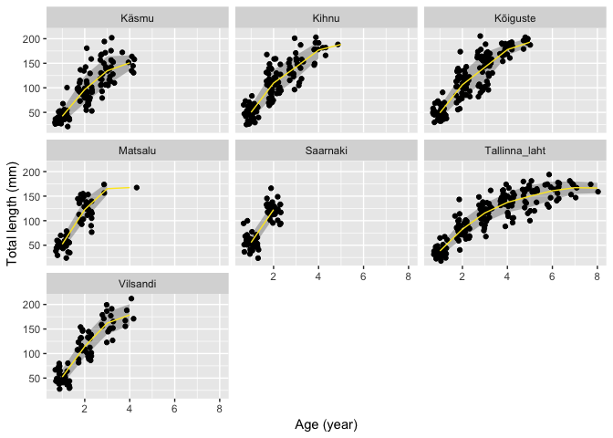
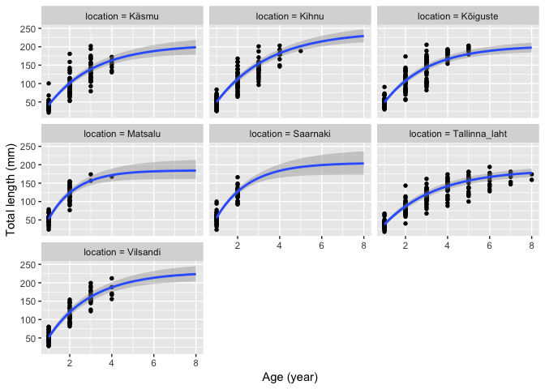

Mudil growth curves
================
rstats Tartu
2018-10-30; (updated 2018-12-14)

## Setup

Load libraries

``` r
library(tidyverse)
library(viridis)
library(brms)
library(here)
library(skimr)
```

Set up stan-mc parameters

``` r
chains <- 4
control_pars <- list(adapt_delta = 0.999)
```

Import data Import and munge dataset.

``` r
mudil <- read_csv(here("output", "andmed_otoliit.csv"))
```

    ## Parsed with column specification:
    ## cols(
    ##   nr = col_integer(),
    ##   sex = col_integer(),
    ##   location = col_character(),
    ##   introduction = col_integer(),
    ##   age = col_integer(),
    ##   tl = col_double()
    ## )

``` r
skim(mudil)
```

    ## Skim summary statistics
    ##  n obs: 961 
    ##  n variables: 6 
    ## 
    ## ── Variable type:character ────────────────────────────────────────────────────
    ##  variable missing complete   n min max empty n_unique
    ##  location       0      961 961   5  13     0        7
    ## 
    ## ── Variable type:integer ──────────────────────────────────────────────────────
    ##      variable missing complete   n    mean    sd   p0  p25  p50  p75 p100
    ##           age       0      961 961    2.17  1.28    0    1    2    3    8
    ##  introduction       0      961 961 2011.78  3.76 2005 2012 2012 2014 2016
    ##            nr       0      961 961   28.48 17.57    1   14   27   41   85
    ##           sex       0      961 961    0.91  1.06    0    0    1    1    3
    ##      hist
    ##  ▇▇▃▂▁▁▁▁
    ##  ▅▁▁▁▁▇▃▃
    ##  ▇▇▇▇▅▂▁▁
    ##  ▇▁▇▁▁▁▁▃
    ## 
    ## ── Variable type:numeric ──────────────────────────────────────────────────────
    ##  variable missing complete   n  mean    sd    p0   p25   p50    p75 p100
    ##        tl       0      961 961 96.03 48.07 11.79 51.31 94.54 134.46  212
    ##      hist
    ##  ▃▇▅▆▆▅▃▁

Fish id: location + nr

``` r
mudil %>% 
  group_by(nr, age, location) %>% 
  summarise(N = n())
```

    ## # A tibble: 961 x 4
    ## # Groups:   nr, age [?]
    ##       nr   age location          N
    ##    <int> <int> <chr>         <int>
    ##  1     1     1 Käsmu             1
    ##  2     1     1 Kihnu             1
    ##  3     1     1 Kõiguste          1
    ##  4     1     1 Matsalu           1
    ##  5     1     1 Saarnaki          1
    ##  6     1     1 Tallinna laht     1
    ##  7     1     1 Vilsandi          1
    ##  8     1     2 Käsmu             1
    ##  9     1     2 Kihnu             1
    ## 10     1     2 Kõiguste          1
    ## # ... with 951 more rows

``` r
mudil_mod <- mudil %>% 
  mutate(location = str_replace_all(location, "\\s", "_"),
         id = str_c(location, nr, sep = "_"),
         sex = case_when(
           sex == 0 ~ "F",
           sex == 1 ~ "M",
           sex == 3 ~ "juv"
         )) %>% 
  select(id, everything())
```

Only adult fish

``` r
mudil_ad <- filter(mudil_mod, sex != "juv")
```

Mean and sd of fish at different age

``` r
mudil_ad %>% 
  group_by(age) %>% 
  summarise_at("tl", funs(mean, sd))
```

    ## # A tibble: 8 x 3
    ##     age  mean    sd
    ##   <int> <dbl> <dbl>
    ## 1     1  48.4  14.5
    ## 2     2 106.   26.5
    ## 3     3 137.   28.8
    ## 4     4 158.   25.8
    ## 5     5 160.   27.0
    ## 6     6 161.   18.6
    ## 7     7 167.   12.5
    ## 8     8 167.   10.6

Individual growth curves

``` r
ggplot(data = mudil_ad) +
  geom_line(mapping = aes(x = age, y = tl, group = id, color = sex), alpha = 2/3) +
  facet_wrap(~location) +
  scale_color_viridis_d() +
  labs(x = "Age (year)", y = "Total length (mm)")
```

<!-- -->

Weird fish in Saarnaki:

``` r
fish_id <- mudil_ad %>% 
  filter(location == "Saarnaki") %>% 
  mutate(ad = tl - tl[age == 1]) %>% 
  filter(ad < 0) %>% 
  pull(id)
```

    ## Warning in tl - tl[age == 1]: longer object length is not a multiple of
    ## shorter object length

Drop this weird fish

``` r
mudil_ad <- filter(mudil_ad, id != fish_id)
ggplot(data = mudil_ad) +
  geom_line(mapping = aes(x = age, y = tl, group = id, color = sex), alpha = 2/3) +
  facet_wrap(~location) +
  scale_color_viridis_d() +
  labs(x = "Age (year)", y = "Total length (mm)")
```

<!-- -->

Average length at age in adults

``` r
ggplot(data = mudil_ad, mapping = aes(x = age, y = tl)) +
  stat_summary(fun.data = mean_sdl, fun.args = list(mult = 1), geom = "ribbon", alpha = 0.3) +
  geom_point(position = position_jitter(width = 1/3)) +
  stat_summary(fun.y = mean, geom = "line", color = viridis(6)[6]) +
  facet_wrap(~location) +
  labs(x = "Age (year)", y = "Total length (mm)")
```

<!-- -->

Growth curves per introduction year

``` r
ggplot(data = mudil_ad, mapping = aes(x = age, y = tl)) +
  stat_summary(fun.data = mean_sdl, fun.args = list(mult = 1), geom = "ribbon", alpha = 0.3) +
  geom_point(position = position_jitter(width = 1/3)) +
  stat_summary(fun.y = mean, geom = "line", color = viridis(6)[6]) +
  facet_wrap(~introduction) +
  labs(title = "Growth curves per introduction year", 
       x = "Age (year)", 
       y = "Total length (mm)")
```

<!-- -->

## Modeling

Get reasonable starting values for van bertalaffny model coefficients.

``` r
library(FSA)
svTypical <- vbStarts(tl ~ age, data = mudil_ad)
unlist(svTypical)
```

    ##        Linf           K          t0 
    ## 168.0135717   0.6837691   0.5048853

Set up prior with suggested starting values using normal distribution
First model, individual variance and different sd per age Total length
modeled by van bertalanffy

``` r
vbgf_f <- tl ~ Linf * (1 - exp(-K * (age - t0)))
```

van bertalanffy model coefficients can vary by location and we take
individual differences into account as random effect.s

``` r
vbgf_coefs_f <- Linf + K + t0 ~ location + (1 | id)
```

This is how brms default priors look like:

``` r
get_prior(bf(tl ~ Linf * (1 - exp(-K * (age - t0))), 
             vbgf_coefs_f, 
             sigma ~ age, nl = TRUE),
          data = mudil_ad)
```

    ##                  prior     class                  coef group resp  dpar
    ## 1                              b                                       
    ## 2                              b             Intercept                 
    ## 3                              b         locationKihnu                 
    ## 4                              b      locationKõiguste                 
    ## 5                              b       locationMatsalu                 
    ## 6                              b      locationSaarnaki                 
    ## 7                              b locationTallinna_laht                 
    ## 8                              b      locationVilsandi                 
    ## 9  student_t(3, 0, 63)        sd                                       
    ## 10                            sd                          id           
    ## 11                            sd             Intercept    id           
    ## 12                             b                                       
    ## 13                             b             Intercept                 
    ## 14                             b         locationKihnu                 
    ## 15                             b      locationKõiguste                 
    ## 16                             b       locationMatsalu                 
    ## 17                             b      locationSaarnaki                 
    ## 18                             b locationTallinna_laht                 
    ## 19                             b      locationVilsandi                 
    ## 20 student_t(3, 0, 63)        sd                                       
    ## 21                            sd                          id           
    ## 22                            sd             Intercept    id           
    ## 23                             b                                       
    ## 24                             b             Intercept                 
    ## 25                             b         locationKihnu                 
    ## 26                             b      locationKõiguste                 
    ## 27                             b       locationMatsalu                 
    ## 28                             b      locationSaarnaki                 
    ## 29                             b locationTallinna_laht                 
    ## 30                             b      locationVilsandi                 
    ## 31 student_t(3, 0, 63)        sd                                       
    ## 32                            sd                          id           
    ## 33                            sd             Intercept    id           
    ## 34                             b                                  sigma
    ## 35                             b                   age            sigma
    ## 36 student_t(3, 0, 10) Intercept                                  sigma
    ##    nlpar bound
    ## 1      K      
    ## 2      K      
    ## 3      K      
    ## 4      K      
    ## 5      K      
    ## 6      K      
    ## 7      K      
    ## 8      K      
    ## 9      K      
    ## 10     K      
    ## 11     K      
    ## 12  Linf      
    ## 13  Linf      
    ## 14  Linf      
    ## 15  Linf      
    ## 16  Linf      
    ## 17  Linf      
    ## 18  Linf      
    ## 19  Linf      
    ## 20  Linf      
    ## 21  Linf      
    ## 22  Linf      
    ## 23    t0      
    ## 24    t0      
    ## 25    t0      
    ## 26    t0      
    ## 27    t0      
    ## 28    t0      
    ## 29    t0      
    ## 30    t0      
    ## 31    t0      
    ## 32    t0      
    ## 33    t0      
    ## 34            
    ## 35            
    ## 36

We can set our own priors. Wiki says that adult gobis can be between 150
and 200 mm long, let’s take 200 as a prior fot tl

``` r
kihnu <- prior(normal(170, 35), nlpar = "Linf", lb = 0) +
  prior(normal(0.7, 0.2), nlpar = "K", lb = 0) +
  prior(normal(0.5, 0.2), nlpar = "t0")
```

Fit location model:

``` r
fit2 <- brm(bf(vbgf_f, 
               vbgf_coefs_f, 
               sigma ~ age, nl = TRUE),
            data = mudil_ad,
            family = gaussian(link = "identity"),
            prior = kihnu,
            chains = chains,
            iter = 2000)
fit2 <- add_ic(fit2, ic = "waic")
write_rds(fit2, here("output", "von_bertalanffy_normal_otol_2.rds"))
```

``` r
summary(fit2)
```

    ##  Family: gaussian 
    ##   Links: mu = identity; sigma = log 
    ## Formula: tl ~ Linf * (1 - exp(-K * (age - t0))) 
    ##          Linf ~ 0 + location + (1 | id)
    ##          K ~ 0 + location + (1 | id)
    ##          t0 ~ 0 + location + (1 | id)
    ##          sigma ~ age
    ##    Data: mudil_ad (Number of observations: 791) 
    ## Samples: 1 chains, each with iter = 4000; warmup = 2000; thin = 1;
    ##          total post-warmup samples = 2000
    ## 
    ## Group-Level Effects: 
    ## ~id (Number of levels: 259) 
    ##                    Estimate Est.Error l-95% CI u-95% CI Eff.Sample Rhat
    ## sd(Linf_Intercept)    31.19      2.53    26.24    36.24       1039 1.00
    ## sd(K_Intercept)        0.10      0.01     0.08     0.12        875 1.00
    ## sd(t0_Intercept)       0.08      0.02     0.04     0.11        397 1.00
    ## 
    ## Population-Level Effects: 
    ##                            Estimate Est.Error l-95% CI u-95% CI Eff.Sample
    ## sigma_Intercept                2.16      0.11     1.94     2.38        574
    ## Linf_locationKäsmu           205.93     12.64   182.20   232.12       1682
    ## Linf_locationKihnu           242.31     12.40   219.56   268.79       2541
    ## Linf_locationKõiguste        203.32      8.15   188.30   219.61       1184
    ## Linf_locationMatsalu         185.61     13.94   161.29   215.72       1203
    ## Linf_locationSaarnaki        205.30     17.50   173.32   241.72       1560
    ## Linf_locationTallinna_laht   187.36      6.63   174.74   200.40       1031
    ## Linf_locationVilsandi        230.16     12.74   206.43   256.05       2516
    ## K_locationKäsmu                0.45      0.05     0.37     0.56       1932
    ## K_locationKihnu                0.39      0.04     0.32     0.47       2165
    ## K_locationKõiguste             0.48      0.04     0.41     0.56       1716
    ## K_locationMatsalu              0.78      0.12     0.58     1.04       1390
    ## K_locationSaarnaki             0.66      0.11     0.48     0.91       1426
    ## K_locationTallinna_laht        0.40      0.03     0.35     0.45       1650
    ## K_locationVilsandi             0.48      0.05     0.39     0.58       2525
    ## t0_locationKäsmu               0.50      0.03     0.43     0.57       2196
    ## t0_locationKihnu               0.41      0.03     0.35     0.48       2343
    ## t0_locationKõiguste            0.42      0.03     0.36     0.48       2316
    ## t0_locationMatsalu             0.56      0.04     0.49     0.64       1599
    ## t0_locationSaarnaki            0.51      0.04     0.43     0.59       1854
    ## t0_locationTallinna_laht       0.43      0.04     0.36     0.50       3072
    ## t0_locationVilsandi            0.47      0.04     0.39     0.54       2707
    ## sigma_age                     -0.07      0.04    -0.15     0.01        653
    ##                            Rhat
    ## sigma_Intercept            1.00
    ## Linf_locationKäsmu         1.00
    ## Linf_locationKihnu         1.00
    ## Linf_locationKõiguste      1.00
    ## Linf_locationMatsalu       1.00
    ## Linf_locationSaarnaki      1.00
    ## Linf_locationTallinna_laht 1.00
    ## Linf_locationVilsandi      1.00
    ## K_locationKäsmu            1.00
    ## K_locationKihnu            1.00
    ## K_locationKõiguste         1.00
    ## K_locationMatsalu          1.00
    ## K_locationSaarnaki         1.00
    ## K_locationTallinna_laht    1.00
    ## K_locationVilsandi         1.00
    ## t0_locationKäsmu           1.00
    ## t0_locationKihnu           1.00
    ## t0_locationKõiguste        1.00
    ## t0_locationMatsalu         1.00
    ## t0_locationSaarnaki        1.00
    ## t0_locationTallinna_laht   1.00
    ## t0_locationVilsandi        1.00
    ## sigma_age                  1.01
    ## 
    ## Samples were drawn using sampling(NUTS). For each parameter, Eff.Sample 
    ## is a crude measure of effective sample size, and Rhat is the potential 
    ## scale reduction factor on split chains (at convergence, Rhat = 1).

Plot fits for different
locations

``` r
cond <- make_conditions(data.frame(location = unique(mudil_ad$location)), vars = "location")
p <- plot(marginal_effects(fit2, conditions = cond), points = TRUE, ask = FALSE, plot = FALSE)
p[[1]] + labs(x = "Age (year)", y = "Total length (mm)")
```

<!-- -->

Model with same t0 for all locations Test if we can use common t0 for
all locations

``` r
vbgf_coefs_f <- Linf + K ~ location + (1 | id)
```

``` r
fit21 <- brm(bf(vbgf_f, 
               vbgf_coefs_f, 
               t0 ~ 1,
               sigma ~ age, nl = TRUE),
            data = mudil_ad,
            family = gaussian(link = "identity"),
            prior = kihnu,
            chains = chains,
            iter = 2000)
fit21 <- add_ic(fit21, ic = "waic")
write_rds(fit21, here("output", "von_bertalanffy_normal_otol_21.rds"))
```

``` r
summary(fit21)
```

    ## Warning: There were 25 divergent transitions after warmup. Increasing adapt_delta above 0.8 may help.
    ## See http://mc-stan.org/misc/warnings.html#divergent-transitions-after-warmup

    ##  Family: gaussian 
    ##   Links: mu = identity; sigma = log 
    ## Formula: tl ~ Linf * (1 - exp(-K * (age - t0))) 
    ##          Linf ~ location + (1 | id)
    ##          K ~ location + (1 | id)
    ##          t0 ~ 1
    ##          sigma ~ age
    ##    Data: mudil_ad (Number of observations: 791) 
    ## Samples: 4 chains, each with iter = 2000; warmup = 1000; thin = 1;
    ##          total post-warmup samples = 4000
    ## 
    ## Group-Level Effects: 
    ## ~id (Number of levels: 259) 
    ##                    Estimate Est.Error l-95% CI u-95% CI Eff.Sample Rhat
    ## sd(Linf_Intercept)    35.59      2.97    30.10    41.77       1160 1.00
    ## sd(K_Intercept)        0.11      0.01     0.09     0.13       1407 1.00
    ## 
    ## Population-Level Effects: 
    ##                            Estimate Est.Error l-95% CI u-95% CI Eff.Sample
    ## sigma_Intercept                2.34      0.08     2.18     2.49       2872
    ## Linf_Intercept               181.92      6.64   168.22   194.16       2098
    ## Linf_locationKihnu            60.76     11.17    39.34    82.76       3444
    ## Linf_locationKõiguste         22.03      9.04     5.17    40.82       3284
    ## Linf_locationMatsalu          51.20     17.72    18.91    87.83       2755
    ## Linf_locationSaarnaki         69.39     20.28    29.80   109.15       3667
    ## Linf_locationTallinna_laht    10.57      7.18     0.48    26.72       1915
    ## Linf_locationVilsandi         66.96     13.59    41.03    93.95       3189
    ## K_Intercept                    0.40      0.02     0.36     0.44       3631
    ## K_locationKihnu                0.03      0.02     0.00     0.08       4437
    ## K_locationKõiguste             0.11      0.03     0.05     0.17       3575
    ## K_locationMatsalu              0.12      0.06     0.02     0.23       3091
    ## K_locationSaarnaki             0.09      0.06     0.01     0.22       3417
    ## K_locationTallinna_laht        0.02      0.02     0.00     0.07       3978
    ## K_locationVilsandi             0.05      0.03     0.00     0.13       4604
    ## t0_Intercept                   0.46      0.02     0.43     0.49       3648
    ## sigma_age                     -0.12      0.04    -0.19    -0.05       1584
    ##                            Rhat
    ## sigma_Intercept            1.00
    ## Linf_Intercept             1.00
    ## Linf_locationKihnu         1.00
    ## Linf_locationKõiguste      1.00
    ## Linf_locationMatsalu       1.00
    ## Linf_locationSaarnaki      1.00
    ## Linf_locationTallinna_laht 1.00
    ## Linf_locationVilsandi      1.00
    ## K_Intercept                1.00
    ## K_locationKihnu            1.00
    ## K_locationKõiguste         1.00
    ## K_locationMatsalu          1.00
    ## K_locationSaarnaki         1.00
    ## K_locationTallinna_laht    1.00
    ## K_locationVilsandi         1.00
    ## t0_Intercept               1.00
    ## sigma_age                  1.00
    ## 
    ## Samples were drawn using sampling(NUTS). For each parameter, Eff.Sample 
    ## is a crude measure of effective sample size, and Rhat is the potential 
    ## scale reduction factor on split chains (at convergence, Rhat = 1).

Plot fits for different
locations

``` r
cond <- make_conditions(data.frame(location = unique(mudil_ad$location)), vars = "location")
p <- plot(marginal_effects(fit21, conditions = cond), points = TRUE, ask = FALSE, plot = FALSE)
p[[1]] + labs(x = "Age (year)", y = "Total length (mm)")
```

<!-- -->

Compare models with location-specific t0 and common t0. Let’s use waic
as loo complains about pareto.

``` r
waic(fit2, fit21)
```

    ##                 WAIC    SE
    ## fit2         5754.11 46.19
    ## fit21        5791.09 47.46
    ## fit2 - fit21  -36.98 10.95

Model with location-specific t0 (more parameters) seems to be better, so
let’s go on with it. Introduction year

``` r
vbgf_coefs_f <- Linf + K + t0 ~ introduction + (1 | id)
```

``` r
fit3 <- brm(bf(vbgf_f, 
               vbgf_coefs_f, 
               sigma ~ age, nl = TRUE),
            data = mutate_at(mudil_ad, "introduction", as.factor),
            family = gaussian(link = "identity"),
            prior = kihnu,
            chains = chains,
            iter = 4000)
write_rds(fit3, here("output", "von_bertalanffy_normal_otol_3.rds"))
```

``` r
summary(fit3)
```

    ## Warning: There were 1 divergent transitions after warmup. Increasing adapt_delta above 0.8 may help.
    ## See http://mc-stan.org/misc/warnings.html#divergent-transitions-after-warmup

    ##  Family: gaussian 
    ##   Links: mu = identity; sigma = log 
    ## Formula: tl ~ Linf * (1 - exp(-K * (age - t0))) 
    ##          Linf ~ introduction + (1 | id)
    ##          K ~ introduction + (1 | id)
    ##          t0 ~ introduction + (1 | id)
    ##          sigma ~ age
    ##    Data: mutate_at(mudil_ad, "introduction", as.factor) (Number of observations: 791) 
    ## Samples: 4 chains, each with iter = 4000; warmup = 2000; thin = 1;
    ##          total post-warmup samples = 8000
    ## 
    ## Group-Level Effects: 
    ## ~id (Number of levels: 259) 
    ##                    Estimate Est.Error l-95% CI u-95% CI Eff.Sample Rhat
    ## sd(Linf_Intercept)    32.02      2.98    26.25    37.85       1276 1.01
    ## sd(K_Intercept)        0.10      0.01     0.08     0.12       1595 1.00
    ## sd(t0_Intercept)       0.08      0.02     0.04     0.11        942 1.00
    ## 
    ## Population-Level Effects: 
    ##                       Estimate Est.Error l-95% CI u-95% CI Eff.Sample Rhat
    ## sigma_Intercept           2.14      0.11     1.91     2.34       1629 1.00
    ## Linf_Intercept          176.62      6.31   164.26   188.82       1282 1.00
    ## Linf_introduction2012    60.19     10.22    39.95    80.28       2140 1.00
    ## Linf_introduction2013    71.25     15.27    42.35   101.92       2904 1.00
    ## Linf_introduction2014    31.70     10.55    11.15    52.73       1697 1.00
    ## Linf_introduction2016    29.92     17.14     2.86    67.56       1573 1.00
    ## K_Intercept               0.36      0.02     0.32     0.40       2445 1.00
    ## K_introduction2012        0.03      0.02     0.00     0.09       3536 1.00
    ## K_introduction2013        0.09      0.05     0.01     0.19       3549 1.00
    ## K_introduction2014        0.11      0.04     0.03     0.20       2183 1.00
    ## K_introduction2016        0.31      0.10     0.13     0.52       1545 1.00
    ## t0_Intercept              0.36      0.04     0.29     0.43       2235 1.00
    ## t0_introduction2012       0.08      0.04     0.00     0.15       2824 1.00
    ## t0_introduction2013       0.09      0.05    -0.00     0.18       3451 1.00
    ## t0_introduction2014       0.05      0.05    -0.04     0.15       2578 1.00
    ## t0_introduction2016       0.16      0.04     0.07     0.25       2287 1.00
    ## sigma_age                -0.06      0.04    -0.14     0.03       1829 1.00
    ## 
    ## Samples were drawn using sampling(NUTS). For each parameter, Eff.Sample 
    ## is a crude measure of effective sample size, and Rhat is the potential 
    ## scale reduction factor on split chains (at convergence, Rhat = 1).

Plot out fits for different
locations

``` r
cond <- make_conditions(data.frame(introduction = as.factor(unique(mudil_ad$introduction))), vars = "introduction")
p <- plot(marginal_effects(fit3, conditions = cond), points = TRUE, ask = FALSE, plot = FALSE)
p[[1]] + labs(x = "Age (year)", y = "Total length (mm)")
```

<!-- -->

Effect of location and sex Simple effects

``` r
vbgf_coefs_f <- Linf + K + t0 ~ location + sex + (1 | id)
```

``` r
fit4 <- brm(bf(vbgf_f, 
               vbgf_coefs_f, 
               sigma ~ age, nl = TRUE),
            data = mudil_ad,
            family = gaussian(link = "identity"),
            prior = kihnu,
            chains = chains,
            iter = 4000)
write_rds(fit4, here("output", "von_bertalanffy_normal_otol_4.rds"))
```

``` r
summary(fit4)
```

    ##  Family: gaussian 
    ##   Links: mu = identity; sigma = log 
    ## Formula: tl ~ Linf * (1 - exp(-K * (age - t0))) 
    ##          Linf ~ location + sex + (1 | id)
    ##          K ~ location + sex + (1 | id)
    ##          t0 ~ location + sex + (1 | id)
    ##          sigma ~ age
    ##    Data: mudil_ad (Number of observations: 791) 
    ## Samples: 4 chains, each with iter = 4000; warmup = 2000; thin = 1;
    ##          total post-warmup samples = 8000
    ## 
    ## Group-Level Effects: 
    ## ~id (Number of levels: 259) 
    ##                    Estimate Est.Error l-95% CI u-95% CI Eff.Sample Rhat
    ## sd(Linf_Intercept)    27.58      2.66    22.61    32.85       1722 1.00
    ## sd(K_Intercept)        0.09      0.01     0.07     0.11       2117 1.00
    ## sd(t0_Intercept)       0.08      0.02     0.05     0.11       1078 1.00
    ## 
    ## Population-Level Effects: 
    ##                            Estimate Est.Error l-95% CI u-95% CI Eff.Sample
    ## sigma_Intercept                2.21      0.11     2.00     2.42       1979
    ## Linf_Intercept               168.02      6.17   155.38   179.97       2750
    ## Linf_locationKihnu            58.68     10.05    38.89    77.97       3757
    ## Linf_locationKõiguste         14.47      8.16     1.33    32.04       3238
    ## Linf_locationMatsalu          14.23     11.80     0.54    43.75       2723
    ## Linf_locationSaarnaki         54.85     22.24    12.57    96.97       2682
    ## Linf_locationTallinna_laht     9.34      6.33     0.45    23.78       2789
    ## Linf_locationVilsandi         55.88     13.97    28.31    82.95       2861
    ## Linf_sexM                     42.82      5.54    31.95    53.38       3518
    ## K_Intercept                    0.37      0.02     0.33     0.41       3536
    ## K_locationKihnu                0.02      0.02     0.00     0.07       6030
    ## K_locationKõiguste             0.09      0.04     0.02     0.16       2868
    ## K_locationMatsalu              0.32      0.09     0.15     0.50       2971
    ## K_locationSaarnaki             0.11      0.07     0.01     0.28       2565
    ## K_locationTallinna_laht        0.03      0.02     0.00     0.07       5677
    ## K_locationVilsandi             0.08      0.04     0.01     0.17       3213
    ## K_sexM                         0.01      0.01     0.00     0.04       5825
    ## t0_Intercept                   0.36      0.04     0.29     0.43       2677
    ## t0_locationKihnu               0.03      0.04    -0.05     0.11       3647
    ## t0_locationKõiguste            0.02      0.04    -0.07     0.11       3214
    ## t0_locationMatsalu             0.16      0.05     0.07     0.25       3485
    ## t0_locationSaarnaki            0.07      0.05    -0.02     0.16       3593
    ## t0_locationTallinna_laht       0.05      0.05    -0.04     0.14       3959
    ## t0_locationVilsandi            0.07      0.05    -0.02     0.17       3461
    ## t0_sexM                        0.06      0.02     0.01     0.10       6365
    ## sigma_age                     -0.09      0.04    -0.17    -0.01       2732
    ##                            Rhat
    ## sigma_Intercept            1.00
    ## Linf_Intercept             1.00
    ## Linf_locationKihnu         1.00
    ## Linf_locationKõiguste      1.00
    ## Linf_locationMatsalu       1.00
    ## Linf_locationSaarnaki      1.00
    ## Linf_locationTallinna_laht 1.00
    ## Linf_locationVilsandi      1.00
    ## Linf_sexM                  1.00
    ## K_Intercept                1.00
    ## K_locationKihnu            1.00
    ## K_locationKõiguste         1.00
    ## K_locationMatsalu          1.00
    ## K_locationSaarnaki         1.00
    ## K_locationTallinna_laht    1.00
    ## K_locationVilsandi         1.00
    ## K_sexM                     1.00
    ## t0_Intercept               1.00
    ## t0_locationKihnu           1.00
    ## t0_locationKõiguste        1.00
    ## t0_locationMatsalu         1.00
    ## t0_locationSaarnaki        1.00
    ## t0_locationTallinna_laht   1.00
    ## t0_locationVilsandi        1.00
    ## t0_sexM                    1.00
    ## sigma_age                  1.00
    ## 
    ## Samples were drawn using sampling(NUTS). For each parameter, Eff.Sample 
    ## is a crude measure of effective sample size, and Rhat is the potential 
    ## scale reduction factor on split chains (at convergence, Rhat = 1).

Plot out fits for different
locations

``` r
cond <- make_conditions(expand.grid(sex = unique(mudil_ad$sex), location = unique(mudil_ad$location)), vars = c("location", "sex"))
p <- plot(marginal_effects(fit4, conditions = cond), points = TRUE, ask = FALSE, plot = FALSE, ncol = 2)
p[[1]] + labs(x = "Age (year)", y = "Total length (mm)")
```

<!-- -->

With interaction

``` r
vbgf_coefs_f <- Linf + K + t0 ~ location*sex + (1 | id)
```

``` r
fit5 <- brm(bf(vbgf_f, 
               vbgf_coefs_f, 
               sigma ~ age, nl = TRUE),
            data = mudil_ad,
            family = gaussian(link = "identity"),
            prior = kihnu,
            chains = chains,
            iter = 4000)
write_rds(fit5, here("output", "von_bertalanffy_normal_otol_5.rds"))
```

``` r
summary(fit5)
```

    ## Warning: There were 2 divergent transitions after warmup. Increasing adapt_delta above 0.8 may help.
    ## See http://mc-stan.org/misc/warnings.html#divergent-transitions-after-warmup

    ##  Family: gaussian 
    ##   Links: mu = identity; sigma = log 
    ## Formula: tl ~ Linf * (1 - exp(-K * (age - t0))) 
    ##          Linf ~ location * sex + (1 | id)
    ##          K ~ location * sex + (1 | id)
    ##          t0 ~ location * sex + (1 | id)
    ##          sigma ~ age
    ##    Data: mudil_ad (Number of observations: 791) 
    ## Samples: 4 chains, each with iter = 4000; warmup = 2000; thin = 1;
    ##          total post-warmup samples = 8000
    ## 
    ## Group-Level Effects: 
    ## ~id (Number of levels: 259) 
    ##                    Estimate Est.Error l-95% CI u-95% CI Eff.Sample Rhat
    ## sd(Linf_Intercept)    29.80      2.80    24.49    35.53       2223 1.00
    ## sd(K_Intercept)        0.10      0.01     0.08     0.12       2475 1.00
    ## sd(t0_Intercept)       0.08      0.02     0.03     0.11       1119 1.00
    ## 
    ## Population-Level Effects: 
    ##                                 Estimate Est.Error l-95% CI u-95% CI
    ## sigma_Intercept                     2.24      0.11     2.03     2.45
    ## Linf_Intercept                    174.52      6.01   162.16   185.79
    ## Linf_locationKihnu                 50.36     10.97    28.69    72.22
    ## Linf_locationKõiguste               9.88      7.16     0.38    26.70
    ## Linf_locationMatsalu               12.78     10.79     0.46    40.24
    ## Linf_locationSaarnaki              43.16     22.94     3.25    88.15
    ## Linf_locationTallinna_laht          7.36      5.64     0.25    20.79
    ## Linf_locationVilsandi              41.99     13.37    15.98    68.18
    ## Linf_sexM                          11.85      6.84     0.81    26.46
    ## Linf_locationKihnu:sexM            29.79     14.37     3.83    59.85
    ## Linf_locationKõiguste:sexM         31.82     11.87     7.71    54.35
    ## Linf_locationMatsalu:sexM          12.97     10.75     0.41    39.81
    ## Linf_locationSaarnaki:sexM         17.45     13.26     0.67    49.34
    ## Linf_locationTallinna_laht:sexM    21.30     11.74     1.78    46.76
    ## Linf_locationVilsandi:sexM         54.21     19.04    17.85    92.57
    ## K_Intercept                         0.38      0.02     0.34     0.42
    ## K_locationKihnu                     0.02      0.02     0.00     0.06
    ## K_locationKõiguste                  0.05      0.03     0.00     0.13
    ## K_locationMatsalu                   0.25      0.08     0.09     0.42
    ## K_locationSaarnaki                  0.13      0.09     0.01     0.35
    ## K_locationTallinna_laht             0.02      0.02     0.00     0.06
    ## K_locationVilsandi                  0.05      0.04     0.00     0.14
    ## K_sexM                              0.01      0.01     0.00     0.04
    ## K_locationKihnu:sexM                0.02      0.02     0.00     0.08
    ## K_locationKõiguste:sexM             0.06      0.04     0.00     0.14
    ## K_locationMatsalu:sexM              0.28      0.14     0.04     0.58
    ## K_locationSaarnaki:sexM             0.06      0.06     0.00     0.20
    ## K_locationTallinna_laht:sexM        0.02      0.02     0.00     0.06
    ## K_locationVilsandi:sexM             0.05      0.04     0.00     0.16
    ## t0_Intercept                        0.36      0.04     0.28     0.44
    ## t0_locationKihnu                    0.04      0.05    -0.06     0.15
    ## t0_locationKõiguste                -0.02      0.06    -0.14     0.09
    ## t0_locationMatsalu                  0.13      0.06     0.01     0.25
    ## t0_locationSaarnaki                 0.10      0.06    -0.02     0.22
    ## t0_locationTallinna_laht            0.05      0.05    -0.05     0.15
    ## t0_locationVilsandi                 0.07      0.06    -0.05     0.19
    ## t0_sexM                             0.06      0.05    -0.03     0.15
    ## t0_locationKihnu:sexM              -0.01      0.07    -0.14     0.12
    ## t0_locationKõiguste:sexM            0.06      0.07    -0.07     0.20
    ## t0_locationMatsalu:sexM             0.08      0.07    -0.06     0.23
    ## t0_locationSaarnaki:sexM           -0.02      0.07    -0.16     0.11
    ## t0_locationTallinna_laht:sexM       0.01      0.08    -0.14     0.16
    ## t0_locationVilsandi:sexM            0.00      0.07    -0.14     0.15
    ## sigma_age                          -0.10      0.04    -0.18    -0.02
    ##                                 Eff.Sample Rhat
    ## sigma_Intercept                       2060 1.00
    ## Linf_Intercept                        4351 1.00
    ## Linf_locationKihnu                    7186 1.00
    ## Linf_locationKõiguste                 7365 1.00
    ## Linf_locationMatsalu                  4966 1.00
    ## Linf_locationSaarnaki                 4677 1.00
    ## Linf_locationTallinna_laht            5913 1.00
    ## Linf_locationVilsandi                 6878 1.00
    ## Linf_sexM                             6875 1.00
    ## Linf_locationKihnu:sexM               7486 1.00
    ## Linf_locationKõiguste:sexM            5375 1.00
    ## Linf_locationMatsalu:sexM             7506 1.00
    ## Linf_locationSaarnaki:sexM            8282 1.00
    ## Linf_locationTallinna_laht:sexM       4947 1.00
    ## Linf_locationVilsandi:sexM            9574 1.00
    ## K_Intercept                           7450 1.00
    ## K_locationKihnu                      10195 1.00
    ## K_locationKõiguste                    8819 1.00
    ## K_locationMatsalu                     5295 1.00
    ## K_locationSaarnaki                    3889 1.00
    ## K_locationTallinna_laht               9243 1.00
    ## K_locationVilsandi                    8644 1.00
    ## K_sexM                               11317 1.00
    ## K_locationKihnu:sexM                 11269 1.00
    ## K_locationKõiguste:sexM               9862 1.00
    ## K_locationMatsalu:sexM                5487 1.00
    ## K_locationSaarnaki:sexM               5687 1.00
    ## K_locationTallinna_laht:sexM         11601 1.00
    ## K_locationVilsandi:sexM              11478 1.00
    ## t0_Intercept                          5285 1.00
    ## t0_locationKihnu                      6547 1.00
    ## t0_locationKõiguste                   7372 1.00
    ## t0_locationMatsalu                    6486 1.00
    ## t0_locationSaarnaki                   7396 1.00
    ## t0_locationTallinna_laht              6946 1.00
    ## t0_locationVilsandi                   7258 1.00
    ## t0_sexM                               5536 1.00
    ## t0_locationKihnu:sexM                 6846 1.00
    ## t0_locationKõiguste:sexM              6937 1.00
    ## t0_locationMatsalu:sexM               7374 1.00
    ## t0_locationSaarnaki:sexM              8343 1.00
    ## t0_locationTallinna_laht:sexM         7202 1.00
    ## t0_locationVilsandi:sexM              8253 1.00
    ## sigma_age                             2631 1.00
    ## 
    ## Samples were drawn using sampling(NUTS). For each parameter, Eff.Sample 
    ## is a crude measure of effective sample size, and Rhat is the potential 
    ## scale reduction factor on split chains (at convergence, Rhat = 1).

Plot out fits for different
locations

``` r
cond <- make_conditions(expand.grid(sex = unique(mudil_ad$sex), location = unique(mudil_ad$location)), vars = c("location", "sex"))
p <- plot(marginal_effects(fit5, conditions = cond), points = TRUE, ask = FALSE, plot = FALSE, ncol = 2)
p[[1]] + labs(x = "Age (year)", y = "Total length (mm)")
```

<!-- -->
